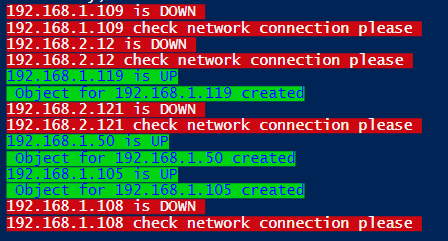
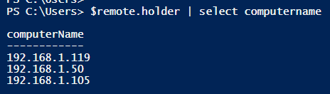
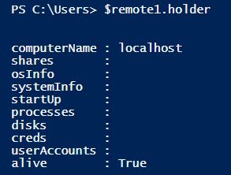
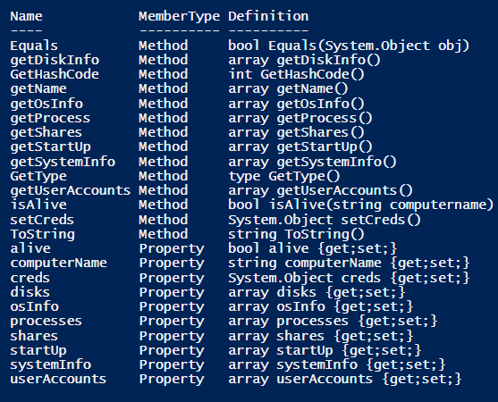
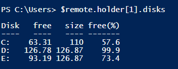
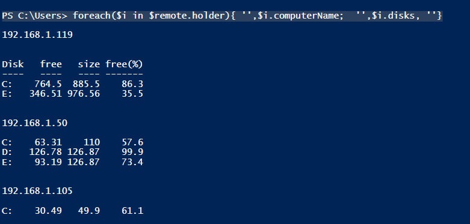
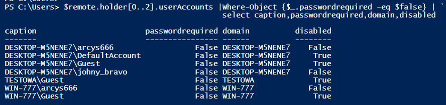
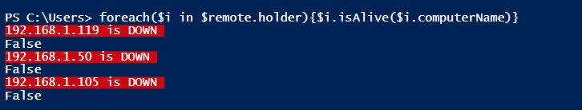
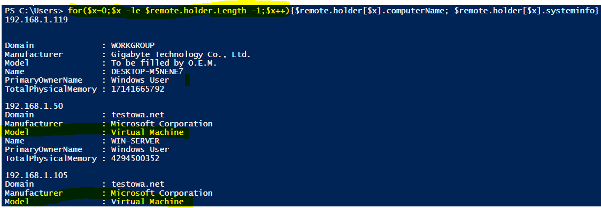
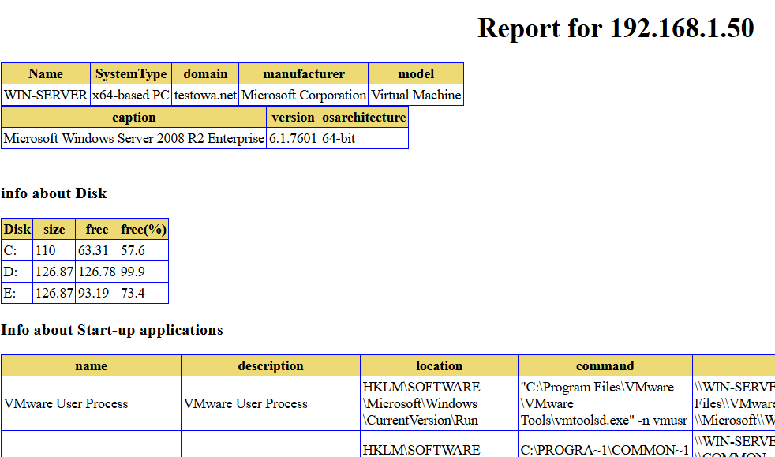

| Another article about Hunting malware with Powershell --> [PS for hunting malware](https://art-ek.github.io/pshell-virusTotal/) | | An article about HTTP status codes –> [HTTP status codes](https://art-ek.github.io/HTTP-codes-URL-and-redirects/) |


## PowerShell automation for SysAdmins. With real life OOP example. ##

As you have read my previous article, you probably know what PowerShell is, right?

PowerShell is a command-line-shell with associated scripting language, that allows to simplify the management of Windows or even NIX systems. Yes, together with .NET Core it can be used on any system now. Unlike text-based shells, PowerShell is built on .NET Framework and later .NET Core, providing you with a huge set of built-in functionalities. And on top of that, PowerShell is fully object oriented! That means in PowerShell **everything is an object**.

So why not to create your own ? Yeah, that’s the idea and slowly we will get there.

But what about automation? What is it and why you want to use it?

These days, we all spend too much time on repetitive tasks to accomplish various jobs. It’s time consuming, sometimes even boring and it’s so easy to make mistake when you have something to do for another 10000 time. Wouldn’t be neat to create some script, put some logic behind it and automate everything? Definitely!

Let’s have a look at one script I created some time ago and how it’s used for task automation.

It’s a simple inventory script which uses WMI to return some information from your remote systems.

*To run this script, you must use PowerShell >=5 , as I've used .NET classes. *

To achieve that I have created two classes. First class [InfObj] represents our remote system which holds all properties, such as computer name, start-up applications, shared drives etc. And as it is an object it also has some methods, for instance with these methods you can check if remote system is online, to get info about drives or even get a list of running processes and sort them by PID or time creation

Another class [SystemAudit] will be our “control class” where all the computers together with their properties will be saved and wait for additional “processing”. This class has only two methods, one is to create a simple html report and another to get fresh data from your remote systems.

And now let’s create some objects from it.
```
$remote=[startAudit]::new(‘.\computers.txt’,[password]::true)
```

At least 3 objects have been created, that means 3 devices were online



```
 $remote.holder | select computername
```


Indeed we have 3 objects saved in our holder’s array and each object will have the following properties.



Let’s query our first computer and check its properties. As you already have checked the source code, you know there are many different ones. But you don’t need to remember any of them, use **get-member** cmdlet instead

```
$remote.holder | get-member
```
and voila! the properties and methods are listed



Now, the following command will display information about computer's disks from the second item in our array

```
$remote.holder[1].disks
```


Do it again, but set the index to [0] and you will see information about disks from our first computer.

But wait! all these operations I’ve performed were on a single object. And if we have hundreds of devices in our array? then what? Then we should do something to automate this a little bit! We are not going to iterate through our collection with hundreds of items manually, are we? NO!

Bring on the **loops!** I believe mastering for, foreach or any other loop in PowerShell will not only take your skills to the next level but it will definitely help you with **task automation**.

Let’s go back to our previous example, but this time I will use Foreach loop to go through our collection and display the result on the screen for all computers not just one.



Or you can create even more complex one, with the following you could check if there are any disabled accounts or even accounts where password is not required!

```
PS C:\Users> $remote.holder[0..2].userAccounts |`

             Where-Object {$_.passwordrequired -eq $false} |`

             select caption,passwordrequired,domain,disabled

```


Nice!!

What else we can do with our collection? Anything. We also can use methods previously defined in our class. Example of some instance method below.

```
[Bool] isAlive([String]$computername){

       $ping = New-Object System.Net.NetworkInformation.Ping

       $ping_status=$ping.Send($computername)

       if($ping_status.Status -eq 'Success'){

           $this.alive=$true

           Write-Host "$($computername) is UP" -BackgroundColor green -ForegroundColor blue

       }else {

           Write-Host "$($computername) is DOWN " -BackgroundColor red

           $this.alive=$false    

       }
   

   return $this.alive 

   }
   
```

And with Foreach loop you can use it on each item in the collection!



Or just FOR loop



To summarize, with Powershell loops you can achieve literally everything. Yup, get familiar with them if you want to take automation seriously.

And now, as we have our small collection of 3 computers saved in array, we can create some trivial report for all of them. For that I have created another method which again will automate everything for us.

```
PS C:\Users> $remote.doReport($remote.holder)
```
To see this method and the loop , please check the source code

```
for($x=0;$x -le $this.holder.Length-1;$x++){
            $pre = "<h1 align='center'><BR>Report for $($this.holder[$x].computername)</h1>"

            
            $obj[$x].systeminfo| select Name,SystemType,domain,manufacturer,model | ConvertTo-Html -Head $head  -PreContent      
            $obj[$x].osinfo |select caption,version, osarchitecture | ConvertTo-Html  | Out-File $fileName -Append

```
And this is how your automated report could look like. Obviously, you might want to customize the look of the report and even decide what information you want to see. It’s entirely up to you, everything can be "piped" to the select-object, where-object and any other PowerShell cmdlet. so you can make your own selection of properties you might want to include in this report.

Example below.




Now imagine how much time you can save with task automation. So, all I can say is:

 # AUTOMATE ALL THE THINGS! #

 It’s fun, it could reduce your time on repetitive tasks and you might learn alongside.

 Thanks for reading!
